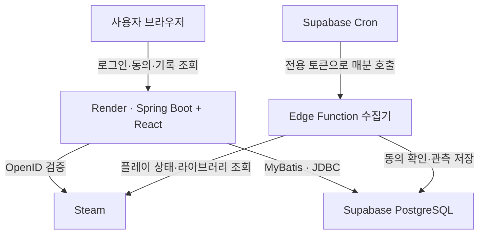

# 🎮 Game Chronicle

**게임을 켜면 쌓이는 나만의 플레이 타임라인.**

Steam 계정을 연결하고 수집을 시작하면, 플레이 상태를 주기적으로 관측해 날짜별 기록과 통계로 보여주는 개인 프로젝트입니다. 브라우저를 계속 열어 두지 않아도 Supabase 예약 작업이 수집합니다.

[서비스 열기](https://game-chronicle.onrender.com) · [개발 환경 설정](docs/development.md) · [수집 구조](docs/architecture.md) · [검증 기록](docs/verification.md)

## 프로젝트 소개

Steam의 누적 플레이시간에 더해 **언제 어떤 게임을 했는지** 돌아볼 수 있는 기록을 만들고자 시작했습니다. 로그인·조회용 웹 서버와 주기적인 수집 작업을 분리하고, 수집에 실패한 시간을 플레이시간으로 오인하지 않도록 설계했습니다.

- **구분:** 개인 프로젝트 / 초기 버전 배포 및 개선 중
- **개발 방식:** ChatGPT·Codex를 활용한 기획, 구현, 검증 및 배포
- **운영 구조:** Render의 Spring Boot 웹 서버 + Supabase PostgreSQL·Cron·Edge Functions

## 사용 방법

1. 사이트에서 **Steam 로그인**을 합니다. 로그인 전에는 샘플 화면을 둘러볼 수 있습니다.
2. Steam 프로필과 게임 정보를 공개하고, 사이트에서 **수집 시작**에 동의합니다. 수집은 기본 OFF입니다.
3. 게임을 플레이하면 Supabase가 **1분 주기**로 상태를 조회하고 기록합니다.
4. 대시보드와 타임라인에서 기록을 확인합니다. 사이트를 닫아도 수집하며, **수집 중지**를 누르면 멈춥니다.

> 기록은 Steam API 관측에 기반한 추정값입니다. 정확한 게임 실행·종료 시각이나 초 단위 실시간 감지를 보장하지 않습니다. 수집 시작 전의 상세 타임라인은 복원하지 않으며, Steam 누적시간은 별도로 표시합니다. 웹 서버가 쉬고 있으면 첫 접속에 기동 대기가 생길 수 있습니다.

## 주요 기능

| 기능 | 구현 내용 |
| --- | --- |
| Steam 연동 | OpenID 로그인, JDBC 로그인 세션, 라이브러리 동기화 |
| 자동 수집 | 명시적 동의, 시작·중지, Supabase의 1분 주기 관측 |
| 플레이 타임라인 | 날짜별 세션, 유효 구간 상세, 기록 제외·복원 |
| 통계 | 일별 활동 잔디, 시간대·요일별 플레이 분포 |
| 라이브러리 | 검색·정렬·상세, 누적시간, 이미지 대체 처리, 더 보기 |
| 사용자 설정 | 이름·시간대, CSV·JSON 내보내기, 계정 삭제 |
| 화면 | 샘플 데이터, 다크·라이트 테마, 모바일 대응 |

## 기술 스택

| 영역 | 기술과 용도 |
| --- | --- |
| Frontend | React 19, TypeScript, Vite — 대시보드·타임라인·통계 |
| Backend | Java 17, Spring Boot 3.5, MyBatis — 로그인·동의·조회 API |
| 인증 | Steam OpenID, Spring Security, Spring Session JDBC |
| 데이터 | Supabase PostgreSQL — 비공개 chronicle 스키마, JSONB, RLS |
| 수집 | Supabase Cron·pg_net, Edge Functions — TypeScript 관측 엔진 |
| 배포·검증 | Docker, Render, Gradle 8.14, GitHub Actions |

## 시스템 구조



**웹 요청과 수집의 실행 주체를 분리했습니다.** 운영 DB의 `collector_control.engine=edge`가 수집 소유권을 결정하고, Render는 `TRACKING_ENABLED=false`로 둡니다. 화면의 수집기 상태는 DB heartbeat로 판단합니다. 라이브러리는 매분 대상 1명을 처리하며, 기본 24시간 간격 또는 사용자 요청으로 갱신합니다.

## 핵심 설계와 문제 해결

### 웹 서버가 쉬어도 수집할 수 있도록 분리

웹 서버 내부 스케줄러에 수집을 맡기면 웹 서버 중단이 기록 공백으로 이어집니다. 수집을 Supabase Cron과 Edge Function으로 옮기고, Render는 로그인과 조회를 담당하도록 변경했습니다. 전환 시 DB 잠금과 토큰을 갱신해 이전 수집기의 늦은 응답이 기록을 덮어쓰지 못하게 했습니다.

**확인한 결과:** Render 수집 OFF 및 재배포 완료 후에도 Edge의 관측 시각이 갱신됐습니다. 실제 15분 이상 유휴 중단 상태를 재현하는 시험은 별도 미검증입니다.

### 관측 공백을 플레이시간으로 더하지 않기

게임 정보가 한 번 사라졌다고 즉시 종료하지 않고, 두 번의 종료 후보를 확인합니다. 시작·종료 경계는 인접 관측 사이의 중간값으로 추정하며, API 오류나 관측 공백은 유효 구간에서 제외합니다. Steam 누적시간과 자체 관측시간은 섞지 않습니다.

### 중복 실행과 동의 철회 처리

작업별 임대와 fencing token으로 오래된 작업의 쓰기를 차단합니다. 저장 직전에 사용자 동의와 활성 상태를 다시 확인합니다. DB의 부분 유일 인덱스로 사용자당 활성 세션 하나를 보장합니다.

### Edge JSON 저장 오류 수정

실제 DB 드라이버에서 JSON 문자열이 이중 인코딩되어 관측 상태가 문자열로 저장되고 라이브러리 일괄 저장이 실패했습니다. 파라미터를 `db.json()`으로 통일하고 영향받은 상태를 객체로 복구했습니다. 이후 실제 라이브러리 동기화와 연속 예약 관측, JSONB 객체 형식을 확인했습니다.

## 데이터 보호

- 로그인은 Steam OpenID로 처리하며 Steam 비밀번호를 앱에서 받지 않습니다.
- 수집 동의와 변경 이력을 보관하고, 개인 조회는 로그인한 사용자 ID로 제한합니다.
- chronicle 스키마는 Data API에 공개하지 않으며, 13개 테이블에 RLS를 적용합니다.
- Edge 호출은 Vault의 전용 토큰으로 인증합니다. 업무 쿼리는 제한된 `app_runtime` 역할로 실행합니다.
- API 키·DB 비밀번호·전용 호출 토큰은 환경변수와 Secrets에 저장합니다.

## 검증 상태

2026-09-13까지 수행한 검증입니다. 아래 테스트 수는 해당 시점의 결과이며 상시 무장애나 부하 처리량을 의미하지 않습니다.

| 구분 | 확인 결과 |
| --- | --- |
| 백엔드 | Java 테스트 33개 통과, bootJar 생성 |
| 수집 엔진 | Node 테스트 11개 통과, Edge TypeScript 검사 통과 |
| 프런트엔드 | TypeScript 검사·Vite 빌드, 배포 사이트 샘플 화면 확인 |
| 실제 연동 | Steam probe 성공, 예약 관측과 라이브러리 동기화 성공 |
| 수집 분리 | Render 수집 OFF·재배포 후에도 관측 갱신 확인 |
| 접근 제어 | 미인증 Edge 호출 401, 공개 DB 역할 접근 차단 확인 |

실계정의 공개·비공개·오프라인·게임 전환 전체 시나리오, 장시간 유휴 중단, 부하 및 백업·복원 시험은 남아 있습니다. [상세 검증 기록](docs/verification.md)과 [전환 및 롤백 절차](docs/edge-collector.md)를 참고하세요.

## 로컬 개발

JDK 17, Node.js 22, Git과 별도 개발 DB가 필요합니다. Windows 환경변수·Steam 키·DB 설정과 Render 배포 방법은 [개발 환경 문서](docs/development.md)에 정리했습니다. 운영 DB의 수집 소유권을 로컬 테스트 목적으로 바꾸지 마세요.

```sh
npm ci --prefix frontend
npm run build --prefix frontend
./gradlew :backend:test :backend:bootJar
node --experimental-strip-types --test supabase/functions/game-chronicle-collector/engine.test.ts
```

| 경로 | 내용 |
| --- | --- |
| `frontend/` | React 화면과 스타일 |
| `backend/` | Spring Boot API, MyBatis, Java 관측 엔진·테스트 |
| `supabase/functions/game-chronicle-collector/` | 운영 Edge 수집기와 엔진 테스트 |
| `supabase/collector-*.sql` | 수집기 설정·예약·전환·롤백 |
| `docs/` | 설계, 실행 방법, 검증 및 운영 기록 |

## 다음 개발 과제

- [ ] 실계정 게임 전환·비공개·오프라인 및 장시간 수집 검증
- [ ] 수집 실패 진단과 운영 알림 개선
- [ ] 오래 플레이한 게임을 바탕으로 추천·신규 게임을 제안하는 기능
- [ ] 세션 메모, 연간 요약, 공유 기능
- [ ] 대규모 집계·삭제 복원 정책과 PC 에이전트 검토

추천·메모·연간 요약·공유·PC 에이전트는 현재 구현에 포함되지 않습니다.
